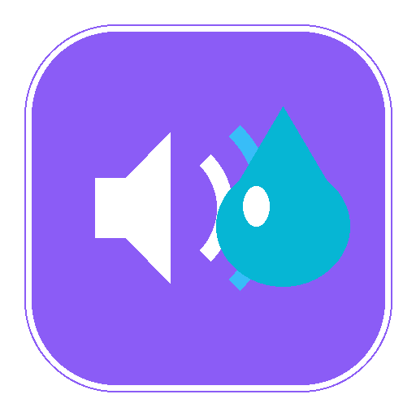
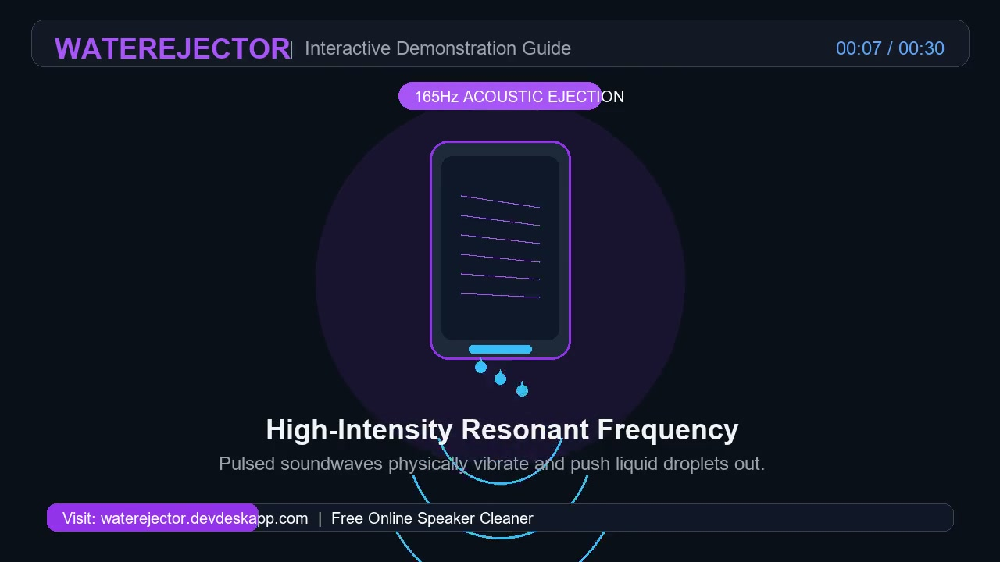

# WaterEjector - Clean & Eject Water Instantly 💦🔊

  

  
  

---

## 🌐 Quick Links
- **Official Live Website:** [https://waterejector.devdeskapp.com/](https://waterejector.devdeskapp.com/)
- **Developed & Supported by:** [DevDeskApp](https://www.devdeskapp.com/)

---

## 📱 About WaterEjector

**WaterEjector** is a free, web-based acoustic cleaner and sound recovery utility engineered to safely eject trapped water, dislodge dry dust, and restore muffled audio from smartphones, smartwatches, earbuds, tablets, and laptops.

Using scientifically calibrated sound frequencies and haptic vibration pulses via the standard HTML5 Web Audio API, it mechanically expels droplets and debris from delicate speaker meshes without any hardware disassembly or software installation.

  

---

## ✨ Features & Tools

1. **Water Ejection (165Hz Pulsed Tone):**
   - Emits a precise 165Hz pulsed bass tone to break surface tension and expel water droplets from speaker cavities.
   - Dual-channel support (Both Speakers, Left Only, Right Only) with a 60-second automatic cycle.

2. **Deep Dust Clean (Acoustic Frequency Sweep):**
   - Sweeps continuous low-to-mid frequencies (100Hz – 250Hz) to mechanically dislodge dry pocket lint, dust particles, and sand.

3. **Haptic Vibration Mode:**
   - Combines low-frequency audio with hardware haptic vibration pulses to physically shake stubborn moisture out of phone grilles.

4. **Stereo Balance Tester:**
   - Dual-channel stereo panner (-1.0 Left to +1.0 Right) to diagnose unequal audio volume across AirPods, earbuds, or device drivers.

5. **Custom Frequency Generator:**
   - Wide-range tone generator from 1Hz to 20,000Hz (20kHz) with live frequency slider control.

6. **Charging Port Moisture Guide & Timer:**
   - Step-by-step emergency instructions for "Liquid Detected in Port" alerts with a built-in 30-minute air-drying countdown timer.

7. **Microphone Diagnostic Tester:**
   - In-browser voice sample recorder and immediate playback tool to check mic clarity and detect water-blocked microphones.

---

## 🎨 User Experience Highlights

- **Zero App Installation:** 100% browser-based, instant access on iOS Safari, Android Chrome, and desktop browsers.
- **Dark & Light Mode:** Seamless theme toggling with automatic OS preference detection.
- **Responsive Design:** Optimized for mobile phones, tablets, and desktop displays.
- **Privacy First:** All audio processing happens locally on your device with no data collection.

---

## 📄 License & Attribution

&copy; 2026 WaterEjector. All rights reserved.  
Proudly created and maintained with [DevDeskApp](https://www.devdeskapp.com/).
